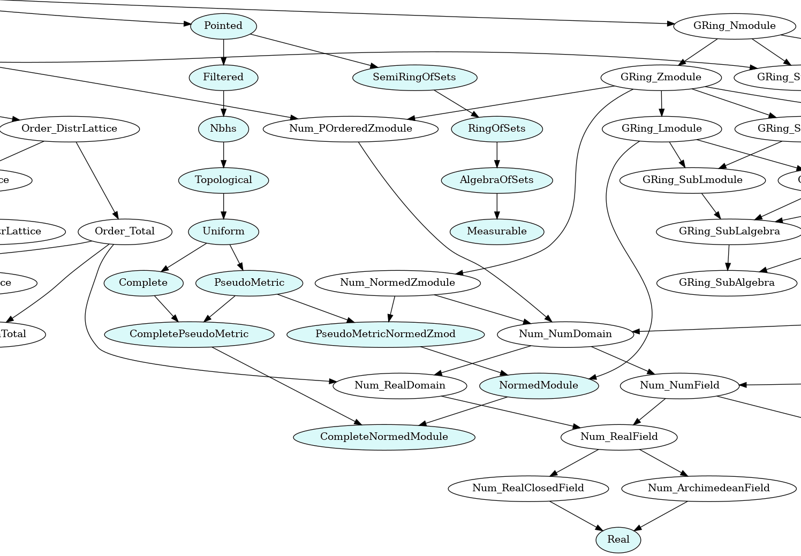
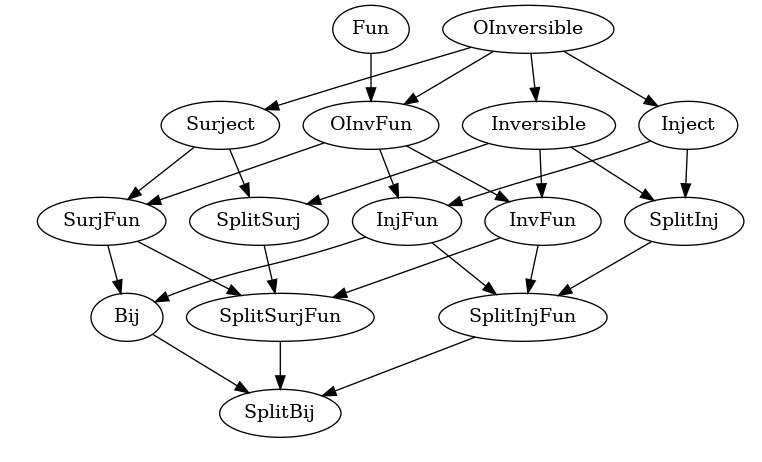
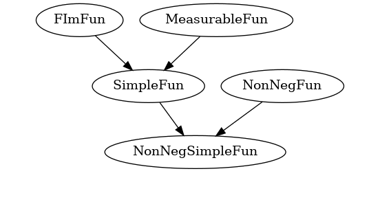
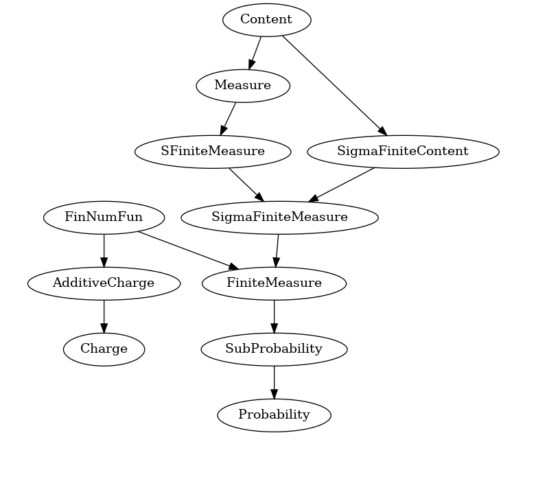
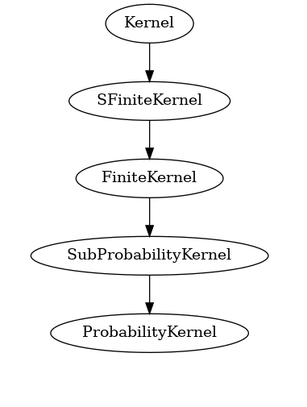

<!---
This file was generated from `meta.yml`, please do not edit manually.
Follow the instructions on https://github.com/coq-community/templates to regenerate.
--->
# Analysis library compatible with Mathematical Components

[![Docker CI][docker-action-shield]][docker-action-link]
[![Chat][chat-shield]][chat-link]

[docker-action-shield]: https://github.com/math-comp/analysis/workflows/Docker%20CI/badge.svg?branch=master
[docker-action-link]: https://github.com/math-comp/analysis/actions?query=workflow:"Docker%20CI"
[chat-shield]: https://img.shields.io/badge/zulip-join_chat-brightgreen.svg
[chat-link]: https://coq.zulipchat.com/login/#narrow/stream/237666-math-comp-analysis

This repository contains a real analysis library for the Coq proof-assistant.
It is based on the [Mathematical Components](https://math-comp.github.io/) library.

In terms of [opam](https://opam.ocaml.org/doc/Install.html), it comes as the following packages:
- `coq-mathcomp-classical`: a layer for classical reasoning
- `coq-mathcomp-analysis`: theories for real analysis

## Meta

- Author(s):
  - Reynald Affeldt (initial)
  - Alessandro Bruni
  - Yves Bertot
  - Cyril Cohen (initial)
  - Marie Kerjean
  - Assia Mahboubi (initial)
  - Damien Rouhling (initial)
  - Pierre Roux
  - Kazuhiko Sakaguchi
  - Zachary Stone
  - Pierre-Yves Strub (initial)
  - Laurent Théry
- License: [CeCILL-C](LICENSE)
- Compatible Coq versions: Coq 8.18 to 8.19 (or dev)
- Additional dependencies:
  - [MathComp ssreflect 2.1.0 or later](https://math-comp.github.io)
  - [MathComp fingroup 2.1.0 or later](https://math-comp.github.io)
  - [MathComp algebra 2.1.0 or later](https://math-comp.github.io)
  - [MathComp solvable 2.1.0 or later](https://math-comp.github.io)
  - [MathComp field 2.1.0 or later](https://math-comp.github.io)
  - [MathComp finmap 2.0.0](https://github.com/math-comp/finmap)
  - [MathComp bigenough 1.0.0](https://github.com/math-comp/bigenough)
  - [Hierarchy Builder 1.4.0 or later](https://github.com/math-comp/hierarchy-builder)
- Coq namespace: `mathcomp.analysis`

## Building and installation instructions

The easiest way to install the latest released version of MathComp-Analysis library is
via the [opam](https://opam.ocaml.org/doc/Install.html) package manager:

```shell
opam repo add coq-released https://coq.inria.fr/opam/released
opam install coq-mathcomp-analysis
```
Note that the package `coq-mathcomp-classical` will be installed as a dependency.

### Manual installation

To build and install manually, make sure that the dependencies are met and do:

``` shell
git clone https://github.com/math-comp/analysis.git
cd analysis
make   # or make -j <number-of-cores-on-your-machine> 
make install
```

## About the stability of this library

Changes are documented systematically in [CHANGELOG.md](CHANGELOG.md) and
[CHANGELOG_UNRELEASED.md](CHANGELOG_UNRELEASED.md).

We bump the minor part of the version number for breaking changes.

We use deprecation warnings to help transitioning to new versions.

We try to preserve backward compatibility as best as we can.

## Documentation

Each file is documented in its header
([documentation for the last version](https://math-comp.github.io/analysis/htmldoc_1_2_0/index.html), using [`coq2html`](https://github.com/xavierleroy/coq2html)).

Overview presentation: [Classical Analysis with Coq](https://perso.crans.org/cohen/CoqWS2018.pdf) (2018)

Publications about MathComp-Analysis:
- [Formalization Techniques for Asymptotic Reasoning in Classical Analysis](https://jfr.unibo.it/article/view/8124) (2018) doi:[10.6092/issn.1972-5787/8124](https://doi.org/10.6092/issn.1972-5787/8124)
- [Formalisation Tools for Classical Analysis](http://www-sop.inria.fr/members/Damien.Rouhling/data/phd/thesis.pdf) (2019)
- [Competing inheritance paths in dependent type theory---a case study in functional analysis](https://hal.inria.fr/hal-02463336) (2020) doi:[10.1007/978-3-030-51054-1_1](https://doi.org/10.1007/978-3-030-51054-1_1)
- [Measure Construction by Extension in Dependent Type Theory with Application to Integration](https://arxiv.org/pdf/2209.02345.pdf) (2023) doi:[10.1007/s10817-023-09671-5](https://doi.org/10.1007/s10817-023-09671-5)
- [The Radon-Nikodým Theorem and the Lebesgue-Stieltjes Measure in Coq](https://www.jstage.jst.go.jp/article/jssst/41/2/41_2_41/_pdf/-char/en) (2024) doi:[10.11309/jssst.41.2_41](https://doi.org/10.11309/jssst.41.2_41)

Other work using MathComp-Analysis:
- [A Formal Classical Proof of Hahn-Banach in Coq](https://lipn.univ-paris13.fr/~kerjean/slides/slidesTYPES19.pdf) (2019)
- [Semantics of Probabilistic Programs using s-Finite Kernels in Coq](https://hal.inria.fr/hal-03917948/document) (2023)
- [CoqQ: Foundational Verification of Quantum Programs](https://arxiv.org/pdf/2207.11350.pdf) (2023)
- [Experimenting with an intrinsically-typed probabilistic programming language in Coq](https://staff.aist.go.jp/reynald.affeldt/documents/syntax-aplas2023.pdf) (2023)

## Mathematical structures

MathComp-Analysis adds mathematical structures on top of MathComp's ones.
The following inheritance diagram displays the resulting hierarchy as of version 1.1.0
(excluding most MathComp structures).
The structures introduced by MathComp-Analysis are highlighted.
(See `topology.v`, `normedtype.v`, `reals.v`, `measure.v`.)




### Hierarchies of functions

| Functions | Functions with a finite image | Measures | Kernels |
|:----------:|:-----------------------------:|:--------:|:-------:|
|  |  |  |  |
| (see `functions.v`) | (see `cardinality.v`, `lebesgue_integral.v`) | (see `measure.v`, `charge.v`) | (see `kernel.v`) |

## Development information

[Detailed requirements and installation procedure](INSTALL.md)

[Developping with nix](https://github.com/math-comp/math-comp/wiki/Using-nix)

[Contributing](CONTRIBUTING.md)

## Previous work reused at the time of the first releases

This library was inspired by the [Coquelicot library](http://coquelicot.saclay.inria.fr/)
by Sylvie Boldo, Catherine Lelay, and Guillaume Melquiond.
`topology.v` and `normedtype.v` contained a reimplementation of file
`Hierarchy.v` from the library Coquelicot.

The instantiation of the mathematical structures of the Mathematical Components library
with the real numbers of the standard Coq library used a well-known file (`Rstruct.v`)
from the [CoqApprox library](http://tamadi.gforge.inria.fr/CoqApprox/) (with
modifications from various authors).

Our proof of Zorn's Lemma in `classical_sets.v` (NB: new filename) is a reimplementation
of the one by Daniel Schepler (https://github.com/coq-community/zorns-lemma); we also took
inspiration from his work on topology (https://github.com/coq-community/topology) for parts
of `topology.v`.

[ORIGINAL_FILES.md](ORIGINAL_FILES.md) gives more details about the
files in the first releases.

## Acknowledgments

Many thanks to [various contributors](https://github.com/math-comp/analysis/graphs/contributors)
