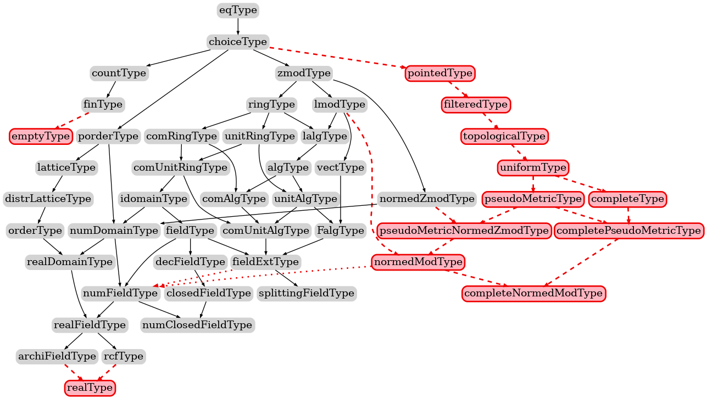

<!---
This file was generated from `meta.yml`, please do not edit manually.
Follow the instructions on https://github.com/coq-community/templates to regenerate.
--->
# Analysis library compatible with Mathematical Components

[![Docker CI][docker-action-shield]][docker-action-link]
[![Chat][chat-shield]][chat-link]

[docker-action-shield]: https://github.com/math-comp/analysis/workflows/Docker%20CI/badge.svg?branch=master
[docker-action-link]: https://github.com/math-comp/analysis/actions?query=workflow:"Docker%20CI"
[chat-shield]: https://img.shields.io/badge/zulip-join_chat-brightgreen.svg
[chat-link]: https://coq.zulipchat.com/login/#narrow/stream/237666-math-comp-analysis


This repository contains an experimental library for real analysis for
the Coq proof-assistant and using the Mathematical Components library.

## Meta

- Author(s):
  - Reynald Affeldt (initial)
  - Yves Bertot
  - Cyril Cohen (initial)
  - Marie Kerjean
  - Assia Mahboubi (initial)
  - Damien Rouhling (initial)
  - Pierre Roux
  - Kazuhiko Sakaguchi
  - Zachary Stone
  - Pierre-Yves Strub (initial)
  - Laurent Théry
- License: [CeCILL-C](LICENSE)
- Compatible Coq versions: Coq 8.14 to 8.16 (or dev)
- Additional dependencies:
  - [MathComp ssreflect 1.13 or later](https://math-comp.github.io)
  - [MathComp fingroup 1.13 or later](https://math-comp.github.io)
  - [MathComp algebra 1.13 or later](https://math-comp.github.io)
  - [MathComp solvable 1.13 or later](https://math-comp.github.io)
  - [MathComp field 1.13 or later](https://math-comp.github.io)
  - [MathComp finmap 1.5.1](https://github.com/math-comp/finmap)
  - [MathComp bigenough 1.0.0](https://github.com/math-comp/bigenough)
  - [Hierarchy Builder >= 1.2.0](https://github.com/math-comp/hierarchy-builder)
- Coq namespace: `mathcomp.analysis`
- Related publication(s):
  - [Formalization Techniques for Asymptotic Reasoning in Classical Analysis](https://jfr.unibo.it/article/view/8124) doi:[10.6092/issn.1972-5787/8124](https://doi.org/10.6092/issn.1972-5787/8124)
  - [Competing inheritance paths in dependent type theory---a case study in functional analysis](https://hal.inria.fr/hal-02463336) doi:[10.1007/978-3-030-51054-1_1](https://doi.org/10.1007/978-3-030-51054-1_1)
  - [Formalisation Tools for Classical Analysis](http://www-sop.inria.fr/members/Damien.Rouhling/data/phd/thesis.pdf) 

## Building and installation instructions

The easiest way to install the latest released version of Analysis library compatible with Mathematical Components
is via [OPAM](https://opam.ocaml.org/doc/Install.html):

```shell
opam repo add coq-released https://coq.inria.fr/opam/released
opam install coq-mathcomp-analysis
```

To instead build and install manually, do:

``` shell
git clone https://github.com/math-comp/analysis.git
cd analysis
make   # or make -j <number-of-cores-on-your-machine> 
make install
```


## Disclaimer

This library is still at an experimental stage.  Contents may
change, definitions and theorems may be renamed, and inference
mechanisms may be replaced at any major version bump.  Use at your
own risk.

## Documentation

Each file is documented in its header.

Changes are documented in [CHANGELOG.md](CHANGELOG.md) and
[CHANGELOG_UNRELEASED.md](CHANGELOG_UNRELEASED.md).

Overview presentation: [Classical Analysis with Coq](https://perso.crans.org/cohen/CoqWS2018.pdf) (2018)

See also "Related publication(s)" [above](https://github.com/math-comp/analysis#meta).

Other work using MathComp-Analysis: [A Formal Classical Proof of Hahn-Banach in Coq](https://lipn.univ-paris13.fr/~kerjean/slides/slidesTYPES19.pdf) (2019)

## Mathematical structures

MathComp-Analysis adds mathematical structures on top of MathComp's ones.
The following inheritance diagram displays the resulting hiearchy
(excluding `countalg` and `finalg` structures). MathComp-Analysis
mathematical structures are on the right, below `pointedType`
included.



## Development information

[Detailed requirements and installation procedure](INSTALL.md)

[Developping with nix](NIX.md)

[Contributing](CONTRIBUTING.md)

## Previous work reused at the time of the first releases

This library was inspired by the [Coquelicot library](http://coquelicot.saclay.inria.fr/)
by Sylvie Boldo, Catherine Lelay, and Guillaume Melquiond.
`topology.v` and `normedtype.v` contained a reimplementation of file
`Hierarchy.v` from the library Coquelicot.

The instantiation of the mathematical structures of the Mathematical Components library
with the real numbers of the standard Coq library used a well-known file (`Rstruct.v`)
from the [CoqApprox library](http://tamadi.gforge.inria.fr/CoqApprox/) (with
modifications from various authors).

Our proof of Zorn's Lemma in `classical_sets.v` (NB: new filename) is a reimplementation
of the one by Daniel Schepler (https://github.com/coq-community/zorns-lemma); we also took
inspiration from his work on topology (https://github.com/coq-community/topology) for parts
of `topology.v`.

[ORIGINAL_FILES.md](ORIGINAL_FILES.md) gives more details about the
files in the first releases.

## Acknowledgments

Many thanks to [various contributors](https://github.com/math-comp/analysis/graphs/contributors)
